# 关键步骤
基础环境：

casServer jdk8 tomcat8以上

casClient jdk7 tomcat7

1、证书生成及添加

2、tomcat https配置

3、服务端代码下载及配置

4、客户端代码下载及配置

## 证书生成及添加

###  服务端生成数字证书的命令
`keytool        -genkey         -keystore    "D:\cas-chenjie\wo_cas.keystore"            -alias    "wo_cas"   -keyalg    "RSA"   -validity  36500      -dname  "CN=localhost, OU=org, O=org.cj, L=南京, ST=江苏, C=中国"   -keypass   "wo_cas"  -storepass    "wo_cas"`

### 服务端导出cer证书文件的命令
`keytool   -alias  "wo_cas"   -exportcert   -keystore    "D:\cas-chenjie\wo_cas.keystore"    -file  "D:\cas-chenjie\wo_cas.cer"   -storepass   "wo_cas"`
### 客户端JRE中导入服务端cer证书的命令
`keytool    -import     -alias    "wo_cas"    -keystore   "D:\Program Files\Java\jdk1.8.0_91\jre\lib\security\cacerts"   -file   "D:\cas-chenjie\wo_cas.cer"    -trustcacerts    -storepass    changeit`

### 删除证书

`keytool -delete -alias "wo_cas" -keystore "D:\Program Files\Java\jdk1.8.0_91\jre\lib\security\cacerts"`

## tomcat https配置

`<Connector SSLEnabled="true" clientAuth="false" connectionTimeout="20000" keystoreFile="D:\\cas-chenjie\\wo_cas.keystore" keystorePass="wo_cas" maxThreads="150" port="8090" protocol="HTTP/1.1" scheme="https" secure="true" sslProtocol="TLS"/>`

注意：路径和密码

## 服务端代码下载及配置
### 代码下载
http://27.115.67.198:10097/wangxb147/casServer
### 建库（mysql）
创建dbname 为cas

导入doc/cas.sql文件

### eclipse中设置tomcat
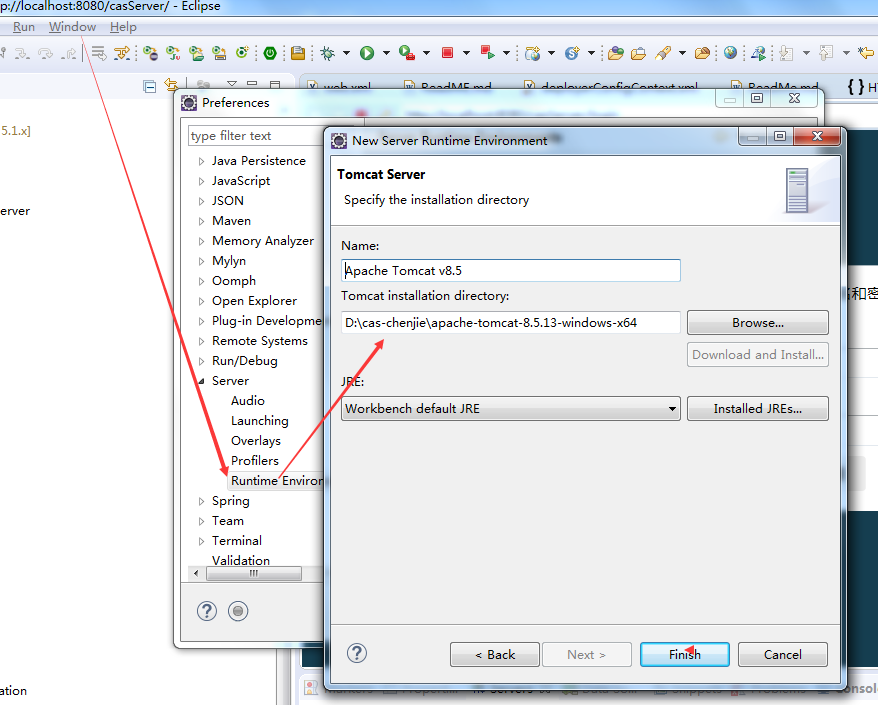

### 修改配置文件deployerConfigContext.xml
### 数据库连接
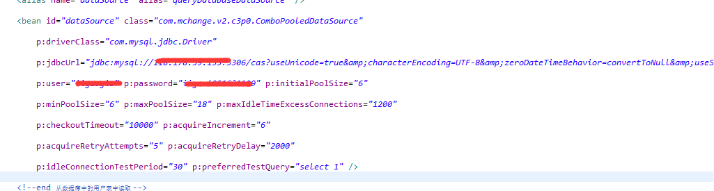

### 启动tomcat
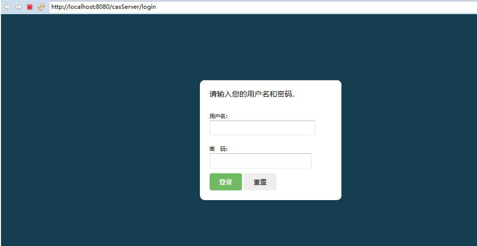

输入https:localhost:8090/casServer

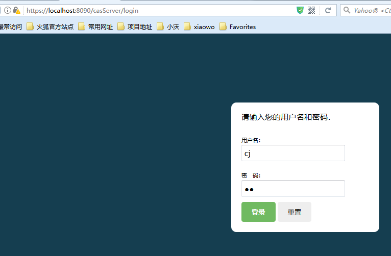
输入cj cj 登录成功

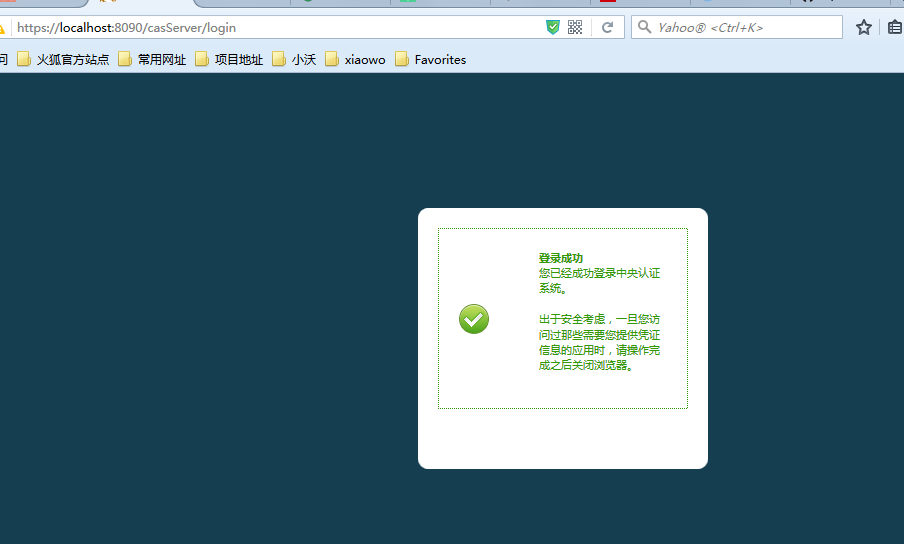

## 客户端代码下载及配置
http://27.115.67.198:10097/wangxb147/casClient1

### 修改web.xml
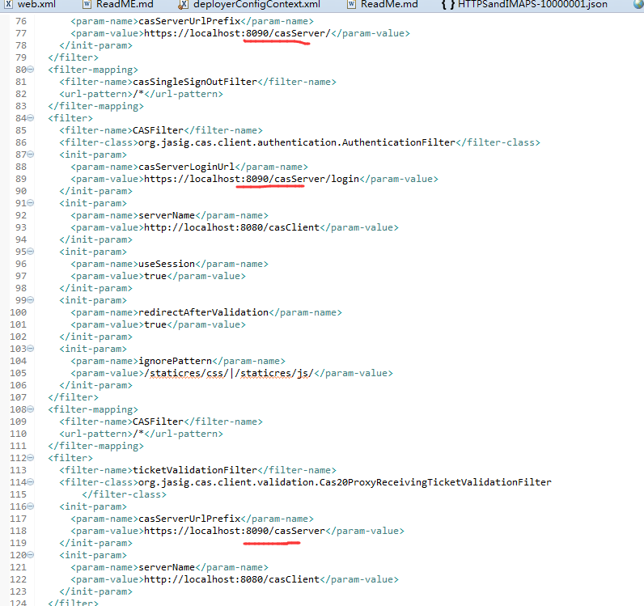

### 启动casClient1
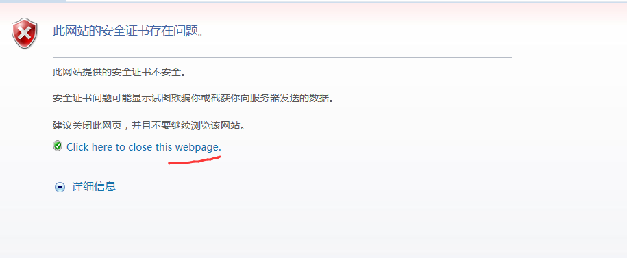

### 首次访问 跳转到casServer输入cj cj登录
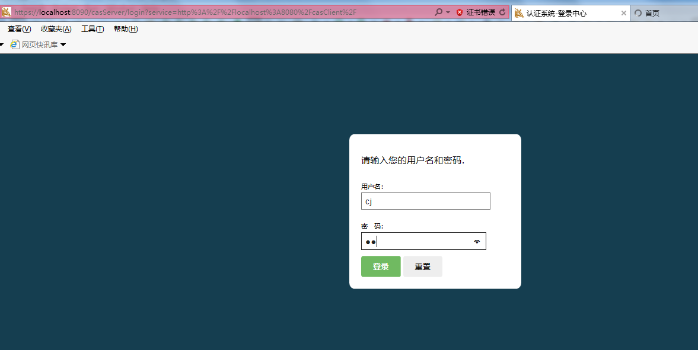

### 登录成功跳转回casClent
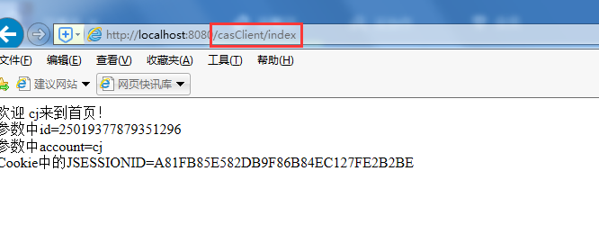

### 请求casClient http://localhost:8080/casClient/demo/test
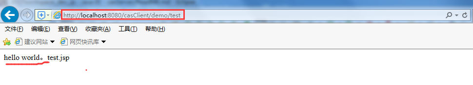

### 跨应用授权
#### 启动casClient2
#### 请求http://localhost:8080/casClient2
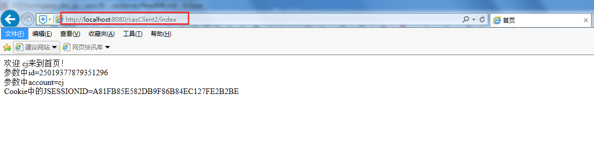

## cas部署问题汇总
[官网](https://github.com/apereo/cas)

[cas-overlay-tempate](https://github.com/apereo/cas-overlay-template)

[cas部署问题汇总](http://note.youdao.com/noteshare?id=8a424b2f59bce4e086b7be8efc11ab37&sub=06EE7A48786E4EF48DF50100653BD897)

[单点登录cas综述之cas4.2.7服务端+cas客户端+示例程序+环境搭建说明-陈杰 ](http://blog.csdn.net/pucao_cug/article/details/70182968)
